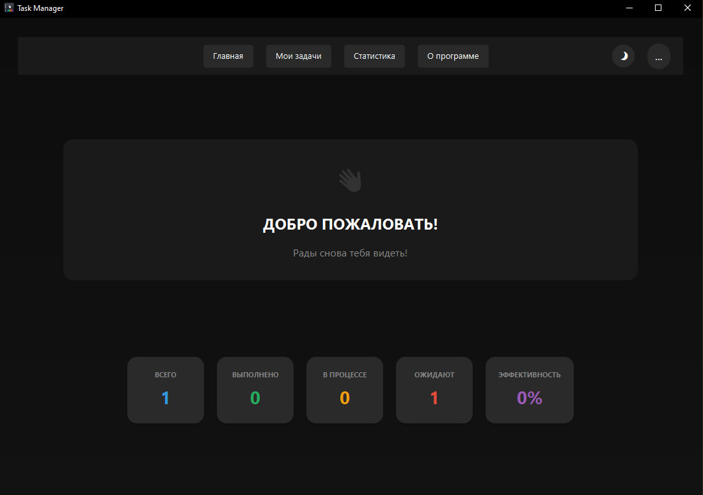

# TaskManager

Десктопное приложение для управления задачами на Java + JavaFX + PostgreSQL.

## Стек технологий
- Java 17
- JavaFX (FXML, Scene Builder)
- PostgreSQL
- JDBC
- Maven

## Функционал
- Добавление задач
- Редактирование задач
- Удаление задач
- Отметка о выполнении
- Смена темы на светлый
- Данные сохраняются в PostgreSQL

## Как запустить
1. Установи PostgreSQL и создай базу данных `taskmanager_db`
2. Выполни SQL-скрипт из файла `schema.sql` (если есть)
3. В файле `application.properties` укажи свои логин и пароль от PostgreSQL
4. Запусти `Main.java`

## Статус проекта

В активной разработке. Используется для обучения и портфолио.